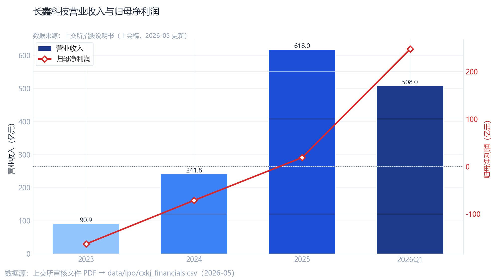

<div align="center">

# Team02-G03：长鑫科技 Pre-IPO 估值再定价研究

[](https://github.com/ganlijie-code/ds2006_G03_ex_Team02.git)
[](https://ganlijie-code.github.io/ds2026_G03_ex_Team02/docs)
[](https://www.python.org/)
[](./report.ipynb)
[](./slides.md)

</div>

---

## 📋 项目概览

| 项目 | 说明                                                                                                        |
|:---|:----------------------------------------------------------------------------------------------------------|
| **小组** | Team 02 · Group G03                                                                                       |
| **选题** | 长鑫科技科创板 Pre-IPO 估值再定价                                                                                     |
| **数据截止** | 2026-05-20（招股说明书上会稿）                                                                                      |
| **GitHub 仓库** | [ganlijie-code/ds2026_G03_ex_Team02](https://github.com/ganlijie-code/ds2006_G03_ex_Team02.git)               |
| **在线阅读** | [ganlijie-code.github.io/ds2026_G03_ex_Team02](https://ganlijie-code.github.io/ds2026_G03_ex_Team02/docs) |

---

## 👥 小组成员

| 姓名 | 学号 | 分工 |
|:---:|:---:|:---|
| 甘立杰 | 25210131 | 研究设计、报告统筹 |
| 廖婉琼 | 25210178 | 报告写作与结论提炼 |
| 刘凤里 | 25210191 | 招股书数据与财务事实整理 |
| 高思远 | 25210133 | 数据获取与清洗脚本 |
| 杨艺欣 | 25210279 | 图表可视化与样式规范 |
| 司徒靖 | 25210231 | CAPM、事件研究与市场定价 |
| 莫福群 | 25210212 | 估值回归与情景分析 |
| 刘飞龙 | 25210190 | 幻灯片制作与汇报材料 |

---

## 🎯 决策主体与选题摘要

本报告面向 **广州证监局** 及关注科创板半导体 IPO 定价与投资者保护的相关方，以 **长鑫科技集团股份有限公司** 在科创板上市前的估值再定价为研究对象。

> **核心问题**：在盈利尚未稳定、但营收已具全球量级（2023—2025 年由约 91 亿增至 618 亿元）的前提下，市场预期由谁主导——一级战略投资者、二级板块资金，还是政策与产业周期下的隐含预期？

报告不给出单一估值公式，而用 **可复核数字** 交叉验证：

1. 📊 招股书与清洗后的财务、产品结构事实
2. 💰 一级估值走廊（约 1,282—1,584 亿元）与同业 ROE、PS 回归隐含市值（约 1,636 亿元）
3. 📈 存储链 CAPM Beta、IPO 事件窗 CAR 及收入路径回归

**数据来源**：上交所招股说明书（上会稿）、akshare 行情与同业财务、公开报道。

---

## 📁 目录结构

```
ds2006_G03_ex_Team02/
├── README.md           # 本说明
├── report.ipynb        # 完整分析 Notebook（代码 + 图表 + 点评）
├── report.html         # Notebook 导出的静态 HTML
├── slides.md           # Marp 汇报幻灯片源码
├── slides.pdf          # 幻灯片 PDF（由 slides.md 导出）
└── data/
    ├── ipo/            # 长鑫招股书清洗数据、IPO 事件
    ├── stock/          # A 股可比公司日线
    ├── index/          # 沪深300、科创50 等指数
    ├── finance/        # 同业同花顺财务摘要、美光年报
    ├── industry/       # 半导体指数
    ├── us/             # 美股 MU、WDC
    ├── macro/          # CPI、M2 等（辅助）
    └── output/         # 图表 PNG、回归 CSV、结论文本（幻灯片插图目录）
```

---

## 📦 交付物说明

| 文件 | 用途 |
|:---|:---|
| `report.ipynb` | 主分析报告：各图单元格可独立运行，含「读图 / 含义 / 启示」点评 |
| `report.html` | 浏览器只读版 |
| `slides.md` | Marp 幻灯片（16:9） |
| `slides.pdf` | PDF，内容与 `slides.md` 一致 |

### 🖼️ 幻灯片插图路径

`slides.md` 中的图表使用 **相对路径** 引用，须与 `slides.md` 同处项目根目录：

```html

```

幻灯片引用的主要 PNG（均位于 `data/output/`）：

| 幻灯片 | 文件名 |
|:---:|:---|
| 图 1 | `fig1_cxkj_revenue_profit.png` |
| 图 2 | `fig6_valuation_range.png` |
| 图 3 | `fig5_roe_peer.png` |
| 图 4 | `fig7_revenue_ols_forecast.png` |
| 图 5 | `fig7_peer_ps_regression.png` |
| 图 6 | `fig2_product_mix.png` |
| 图 7 | `fig4_mu_vs_semiconductor.png` |
| 图 8 | `fig7_capm_beta_dual_benchmark.png` |
| 图 9 | `fig7_event_study_car_detailed.png` |

> ⚠️ **提示**：若预览或导出 PDF 时图片空白，请确认上述文件存在于 `data/output/`，且 Marp 已允许访问本地文件。

---

## 🚀 快速复现

### 1. 环境

在项目根目录使用仓库虚拟环境（或自行安装依赖）：

```bash
# 示例：使用上级目录 .venv
pip install jupyter pandas numpy matplotlib statsmodels akshare
```

### 2. 复现报告与图表

在 Jupyter 中打开 `report.ipynb`，执行 **Kernel → Restart & Run All**。

Notebook 会将图表与回归结果写入 `data/` 下相应目录（与 Notebook 内 `OUTPUT` 配置一致）；**幻灯片请统一使用 `data/output/` 中的 PNG**。

### 3. 导出幻灯片 PDF

在项目根目录执行（需 Node.js）：

```bash
cd ds2006_G03_ex_Team02
npx @marp-team/marp-cli --no-stdin slides.md -o slides.pdf --allow-local-files
```

也可在 VS Code 安装 [Marp for VS Code](https://marketplace.visualstudio.com/items?itemName=marp-team.marp-vscode)，打开 `slides.md` 后导出 PDF，并开启本地图片访问。

---

## 📑 报告结构（幻灯片目录）

| 篇章 | 内容 |
|:---|:---|
| 封面 | 选题、数据截止、陈述时长 |
| 一 | 核心观点（摘要） |
| 二 | 报告结构 / 目录 |
| 三—八 | 研究框架、财务事实、交易背景、政策环境、方法与四维框架 |
| 图表 1—9 | 营收盈利、估值走廊、ROE、OLS、PS 回归、产品结构、全球对照、CAPM、事件研究 |
| 收尾 | 结论与讨论 |

更细的图表—数据对应关系见 `data/output/section7_data_sources.md`。

---

## ⚠️ 声明

本仓库材料基于公开披露与行情数据整理，仅供课程/研究交流，**不构成任何投资建议**。引用数字请以招股说明书上会稿及交易所公告为准。
