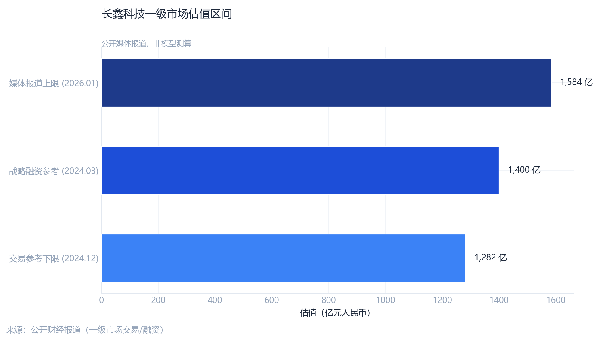
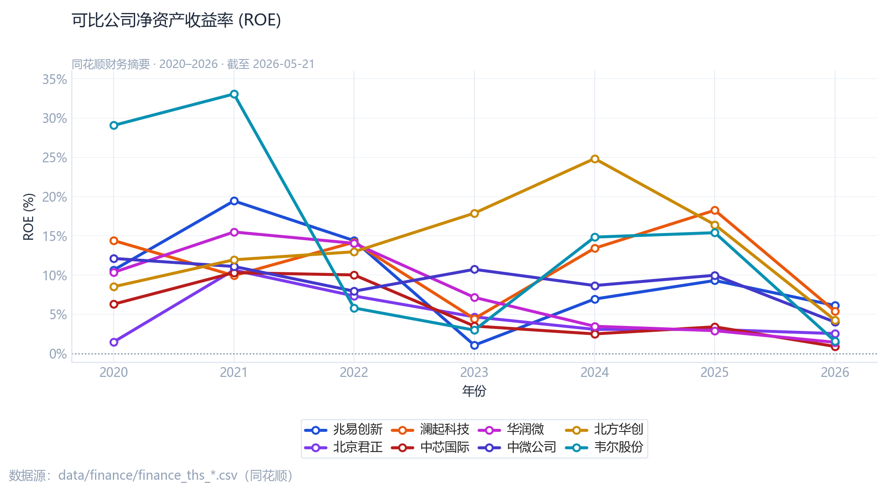
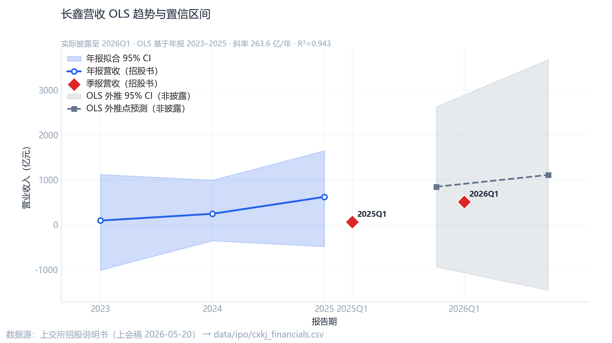
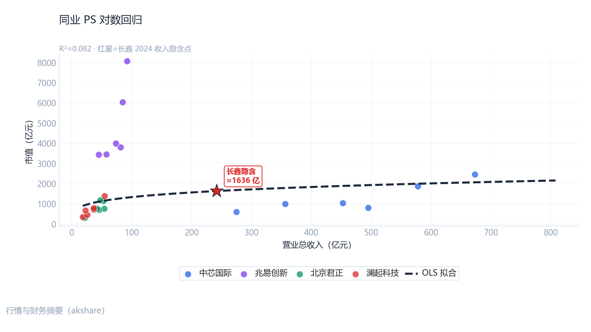
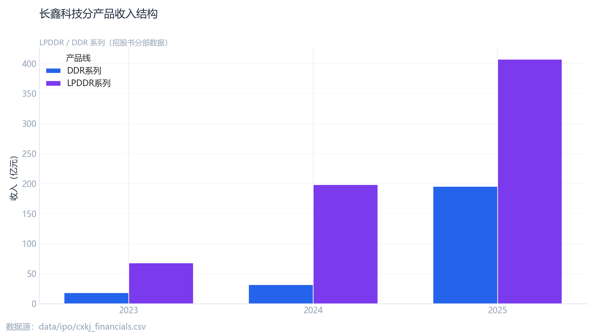
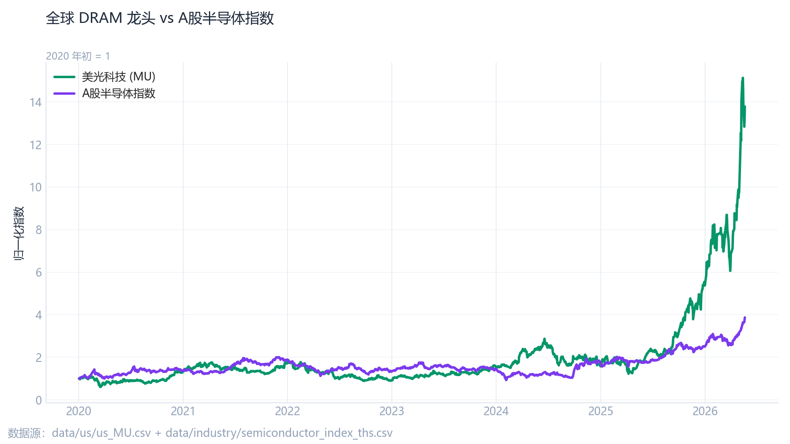
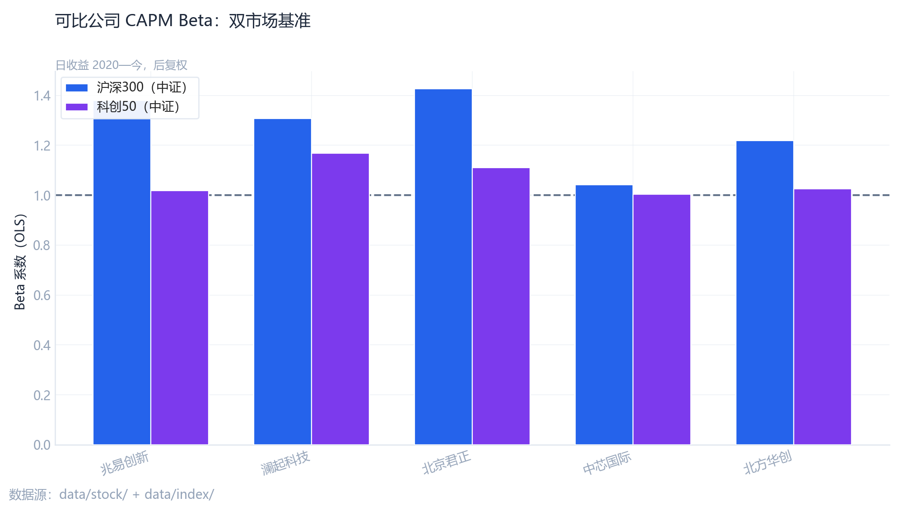
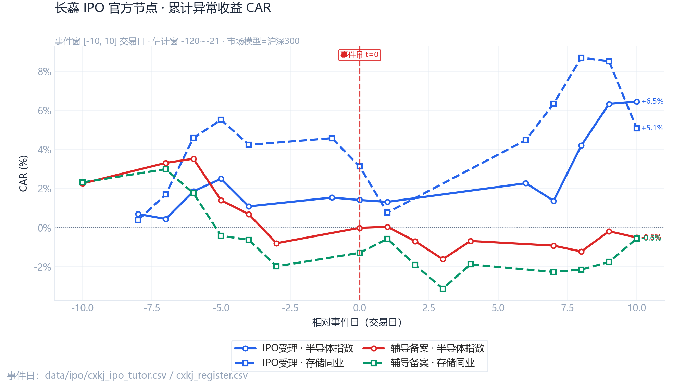

<!-- _class: lead -->
<!-- _paginate: false -->
<!-- _header: "" -->
<!-- _footer: "" -->
<!-- _backgroundColor: #0f2744 -->
<!-- _color: #ffffff -->

# 长鑫科技集团股份有限公司

## 科创板上市前的估值再定价研究

收入高增 · 盈利修复 · 一级定价走廊与同业锚交叉验证

<ul class="lead-meta">
<li><strong>报告日期</strong>2026 年 5 月</li>
<li><strong>数据截止</strong>2026-05-20（上会稿）</li>
<li><strong>陈述时长</strong>约 10 分钟</li>
<li><strong>资料来源</strong>上交所 · akshare · 公开报道</li>
</ul>

---

<!-- _class: exec rich-slide -->

摘要

## 一核心观点

<strong>研报定位</strong>：面向 Pre-IPO 定价与板块联动判断，将长鑫科技置于「<em>高成长存储制造</em>」与「<em>政策背书战略资产</em>」双重标签下考察；结论强调<strong>可复核数字</strong>而非单一估值公式。

摘 要 · 四条主线

<ol class="summary-list">

<li><strong>基本面（图 1、表 1）</strong>：营收 2023—2025 由 91 亿增至 618 亿，增速远超同业均值；2025 年归母净利首次转正（+18.7 亿），但 2022—2025 累计亏损约 409 亿，盈利质量仍取决于 DRAM 价格与产能利用率。</li>

<li><strong>结构与全球（图 6—7）</strong>：LPDDR 2025 年约 407 亿、DDR 约 195 亿，产品组合向移动端倾斜；美光与 A 股半导体指数同向不同步，国内情绪不能替代全球合约价信号。</li>

<li><strong>市场定价（图 3、图 8—9）</strong>：存储链 Beta 普遍高于 1；IPO 受理事件窗 CAR 方向为正但统计不显著，提示消息或已在辅导阶段部分定价。</li>

<li><strong>估值锚（图 2、图 4—5、表 3）</strong>：一级走廊 1,282—1,584 亿与 PS 回归隐含 1,636 亿构成共识带；收入×PE 情景（8/15/25 倍）给出 4,944—15,450 亿上界参考，须与盈利预测及摊薄后股本联动修正。</li>

</ol>

说明：本报告基于公开披露与行情数据整理，仅供研究交流，不构成任何投资建议。

---

<!-- _class: rich-slide toc-slide -->

目录

## 二报告结构

| 篇章 | 主要内容 |
|:--:|:--|
| 一 | 核心观点（摘要） |
| 二—八 | 研究框架、财务事实、交易背景、政策环境、方法与四维框架 |
| 图 1—10 | 基本面 · 产品结构 · 估值走廊 · ROE · 收入路径 · PS 回归 · 全球对照 · Beta · 事件研究 |
| 表 1—3 | 财务序列 · 政策要点 · 估值情景敏感性 |
| 九—十 | 综合判断与局限 |

<strong>阅读提示</strong>：前半部分建立「事实—政策—方法」共识，后半部分用十张图完成交叉验证；若时间有限，可优先保留图 1、2、4、5 与表 3。
<ul>
<li>财务事实页强调<strong>收入跃迁与亏损存量</strong>的并存，避免仅用 PS 横向比较。</li>
<li>图表页采用「左图右评」：左侧完整展示图表，右侧为三层经济解读。</li>
</ul>

---

<!-- _class: rich-slide -->

研究框架

## 三研究问题：定价权握在谁手里？

<strong>核心命题</strong>：在盈利尚未稳定、但收入已具全球量级的前提下，<em>谁</em>在为长鑫的市值买单——一级战略投资者、二级板块资金，还是政策预期下的「隐含担保」？本报告用三条证据链回答：① 招股书可验证事实；② 同业 ROE/Beta 与 PS 锚；③ 事件窗与回归模型的可复核输出。

### 一级市场

跟投与战略配售面对的不是「当前 PE」，而是<strong>未来 2—3 年 DRAM 景气路径</strong>是否已被折进 1,300—1,600 亿走廊；若 2026Q1 高增不可持续，上沿定价的安全边际极薄。

### 二级市场

上市瞬间将触发存储链<strong>资金再配置</strong>：高 Beta 标的对指数有放大效应，但事件研究显示异常收益并不显著，二级更应关注发行折价与解禁节奏而非「题材脉冲」。

### 产业与政策

「自主可控」提供估值<strong>下限期权</strong>，但不能自动抵消 409 亿量级累计亏损与持续 Capex；政策溢价须与毛利率、折旧摊销同屏观察。

### 本报告方法

以招股说明书、行情与同业数据为基础，经清洗与量化模型交叉验证，避免「只给结论、不给依据」的简报缺陷。

---

<!-- _class: rich-slide -->

基本面

## 四财务概览：收入具全球量级，盈利处修复初期

<strong>经济解读</strong>：公司已完成从「烧钱换份额」到「份额换现金流」的第一阶段跃迁——收入三年复合增速极高，但归母净利 2025 年仅小幅转正，说明<strong>价格与利用率</strong>仍是利润弹性的主因；2026Q1 单季收入 508 亿若不能全年化，则当前估值隐含的是景气高位假设。

2025 年营业收入
618 亿元
较 2024 年 242 亿约 +156%

2026 年一季度
508 亿元
单季接近 2024 全年水平

2025 年归母净利润
+18.7 亿元
2024 年仍为 -71 亿元

历史累计净亏损
约 409 亿元
2022—2025，招股书口径

<strong>三点关注</strong>：① 收入规模已支持「全球第四」叙事，但 ROE 尚未稳定；② 研发费用率由约 50% 降至 15%，规模效应显现；③ 累计亏损存量仍是下行周期中的「隐性杠杆」。

---

<!-- _class: data-slide rich-slide -->

基本面

## 表1关键财务指标序列（招股书口径）

| 报告期 | 营业收入 | 归母净利润 | 研发费用 | 研发费用率 |
|:--|--:|--:|--:|--:|
| 2023 | 90.9 亿 | -163.4 亿 | 45.2 亿 | 49.7% |
| 2024 | 241.8 亿 | -71.4 亿 | 46.1 亿 | 19.1% |
| 2025 | 618.0 亿 | +18.7 亿 | 95.9 亿 | 15.5% |
| 2026Q1 | 508.0 亿 | +247.6 亿* | — | — |

<strong>表解读</strong>：2024—2025 年出现「收入跳升 + 亏损收窄」的典型周期复苏形态；2026Q1 营收与净利同步冲高，需对照附注区分<strong>经常性经营利润</strong>与一次性因素。研发费用绝对额仍上升（95.9 亿），显示技术投入未因盈利转正而收缩，对长期毛利率形成刚性支撑亦构成短期压力。

*2026Q1 归母净利须结合附注区分经常性因素。

---

<!-- _class: rich-slide -->

交易背景

## 五募资规模与一级市场心理价位

<strong>交易解读</strong>：拟募资约 295 亿元反映产能与研发继续扩张的决心；一级市场 1,282—1,584 亿走廊相当于以 2024 年收入为锚的 <strong>5—7 倍 PS</strong>，已提前计入 2025—2026 年收入跃迁预期，故二级定价更似「验证」而非「发现」。

拟募集资金
约 295 亿元
科创板受理（2025-12-30）

报道估值走廊
1,282—1,584 亿
约 5.3—6.6× 2024 年收入 PS

产业地位（招股书）
全球第四
中国 DRAM 出货量第一

定价逻辑检验
三条线
收入增速 · 亏损收敛 · 板块 Beta

<strong>定价含义</strong>：全球第四 / 国内第一份额支撑「战略资产」叙事；但若发行定价靠近走廊上沿，投资者承担的实质是<strong>DRAM 景气均值回归</strong>与<strong>资本开支峰值</strong>的双重风险。

注：估值走廊来自公开媒体报道区间，非交易所成交价格。

---

<!-- _class: rich-slide -->

宏观与产业

## 六政策托底与周期波动并存

<strong>宏观叙事</strong>：政策端提供税收优惠与自主可控预期，构成估值「软下限」；市场端则受全球 DRAM 合约价、库存周期与美联储利率路径制约。长鑫定价须在<strong>政策期权</strong>与<strong>商品周期</strong>之间取交集，而非简单叠加。

### 制度环境

国发〔2020〕8 号与「十四五」信息化规划强化存储自主可控 → 降低有效税率、改善融资可得性，形成<strong>长期估值下限</strong>。

### 资本事件轴

辅导备案 → 受理 → 2026-05 上会稿：信息分批释放，一级价格往往在申报—上会阶段即形成锚定。

### 行业节奏

DRAM 合约价与库存周期决定短期收入弹性；A 股半导体指数与 MU <strong>同向但不同步</strong>，须防「国内情绪过热、全球基本面转弱」的错位。

### 对本项目含义

政策溢价可解释 PS 高于成熟制造，但无法单独解释<strong>持续亏损后的转正幅度</strong>——盈利质量才是二级承接的关键。

---

<!-- _class: data-slide rich-slide -->

政策环境

## 表2政策与产业背景要点

| 政策 / 文件 | 经济含义 |
|:--|:--|
| 国发〔2020〕8 号（集成电路） | 税收优惠与产业协同 → 降低有效税率、支撑长期 Capex |
| 「十四五」国家信息化规划 | 存储器等关键环节自主可控 → **战略期权**计入估值 |
| 科创板 IPO 受理（2025-12-30） | 拟募资约 295 亿元；信息披露节奏影响一级定价预期 |
| Omdia 出货量口径（招股书） | 中国 DRAM 出货量第一、全球第四 → 份额叙事支撑 PS 锚 |

---

<!-- _class: rich-slide -->

研究方法

## 七证据链与数据复现路径

<strong>方法说明</strong>：本简报不做黑箱估值。CAPM、事件研究、OLS 与 PS 回归均为<strong>示意性量化</strong>，样本受限处（如仅 3 个年报）已明示，避免过度拟合叙事。

| 数据模块 | 官方 / 公开来源 |
|:--|:--|
| 公司财务 | 上交所招股说明书 PDF（结构化解析） |
| A 股行情与指数 | akshare（沪深300、科创50、半导体指数） |
| 同业财务 | 同花顺摘要（8 家可比公司） |
| 全球对照 | 美光 MU 年报（SEC 披露汇总） |

---

<!-- _class: rich-slide -->

分析框架

## 八四维分析框架：从事实到定价

<strong>框架逻辑</strong>：先确认「量」（收入与结构）→ 再检验「质」（盈利与研发）→ 继而测算「市场风险」（Beta 与事件）→ 最后收敛至「价格走廊」（一级 PS 与回归交叉）。四维任一环节弱化，估值结论即需下调置信度。

① 成长
营收 & 结构
DDR / LPDDR · 2026Q1 脉冲

② 盈利
拐点 & 刚性
归母净利 · 研发费用率

③ 市场
Beta & ROE
板块情绪 · 同业分化

④ 定价
锚 & 敏感性
走廊价 · PS 回归 · 收入×PE

<strong>图表导读</strong>：图 1—5 为核心定价链；图 6—10 补充产品结构、全球对照、Beta 与事件研究；表 3 给出收入×PE 敏感性。

---

<!-- _class: chart-slide -->

图表分析

## 图1营收与盈利：从份额扩张到现金流修复

<strong>图 1</strong> 长鑫科技营业收入与归母净利润（2021—2026Q1）；左轴营收、右轴归母净利润，单位：亿元

图表点评

一、读图

2023—2025 营收由 <em>91 → 242 → 618 亿元</em>；归母净利由 <em>-163 → -71 → +18.7 亿元</em>，2025 年首次站上盈亏线。

二、含义

公司已进入收入<strong>指数型扩张</strong>阶段，但利润对价格与产能利用率仍高度敏感；<em>409 亿元</em> 量级累计亏损意味着一轮下行周期即可显著侵蚀 2025 年盈利修复。

三、启示

估值不应仅锚定收入 PS，须同步跟踪<strong>毛利与折旧</strong>；2026Q1 单季收入 508 亿提示景气高位，亦放大周期反转风险。

---

<!-- _class: chart-slide -->

图表分析

## 图2一级市场估值走廊：预期定价主导

<strong>图 2</strong> 一级市场报道估值区间与参考点（非二级市场成交价格，单位：亿元）

图表点评

一、读图

区间大致覆盖 <em>1,282—1,584 亿元</em>，对应 2024 年收入约 <em>5.3—6.6 倍 PS</em>；下限贴近 2024 年末交易参考，上限反映 2026 年初媒体报道高位。

二、含义

一级市场已在<strong>盈利尚未稳定</strong>阶段给出「成熟成长股」量级的 PS，隐含对 2025—2026 收入高增及份额持续提升的<strong>前置定价</strong>。

三、启示

二级上市定价大概率<strong>参照该走廊</strong>而非 DRAM 现货日度波动；若发行定价靠近上沿，留给二级资金的赔率取决于盈利能否<strong>兑现并维持</strong>。

---

<!-- _class: chart-slide -->

图表分析

## 图3同业 ROE 比较：产业链内部分化显著

<strong>图 3</strong> A 股半导体产业链可比公司净资产收益率（8 家可比公司，2020—2026）

图表点评

一、读图

设备（北方华创、中微）、制造（中芯、华润微）与存储/设计标的 ROE <strong>路径分化</strong>；2024 年前后多数同业 ROE 修复，波动幅度小于纯存储设计龙头。

二、含义

长鑫尚未纳入可比序列，但上市后将面临「<em>高 Beta 存储</em>」与「<em>政策背书制造</em>」的双重标签；市场可能给予高于传统 IDM 的 PS，同时要求更高的盈利可见度。

三、启示

不宜用单一行业 PE 中位数套用；建议按<strong>产业链位置 + ROE 稳定性</strong>分层估值。存储链 CAPM Beta 多显著大于 1，板块情绪对长鑫定价有<strong>放大器效应</strong>。

---

<!-- _class: chart-slide -->

图表分析

## 图4收入路径：披露高增与线性外推的张力

<strong>图 4</strong> 营业收入实际值与 OLS 趋势外推（灰色虚线为模型外推，<strong>非公司指引</strong>）

图表点评

一、读图

年报拟合斜率约 <em>+264 亿元/年</em>（R²≈0.94，但样本仅 3 年，p≈0.15）；2026Q1 单季 508 亿显著高于线性外推的季度化水平。

二、含义

若将 Q1 简单年化，收入体量已处于<strong>极端景气假设</strong>；DRAM 行业存在均值回归，线性外推更适合做<strong>敏感性上下界</strong>，不宜视为管理层预测。

三、启示

收入×PE 情景（8/15/25 倍 → 约 4,944—15,450 亿）展示的是<strong>「若收入维持」</strong>的市值空间，而非基准情形；定价应引入<strong>价格周期 + 产能利用率</strong>折现。

---

<!-- _class: chart-slide -->

图表分析

## 图5PS 回归交叉验证：与走廊同量级

<strong>图 5</strong> 存储产业链市值—营收对数回归与长鑫隐含点（红星为 2024 年收入对应隐含市值）

图表点评

一、读图

对数回归隐含市值约 <em>1,636 亿元</em>，对应 PS 约 <em>6.8×</em>（基于 2024 年 242 亿收入）；模型 R² 仅 <em>0.08</em>，拟合度弱。

二、含义

尽管统计拟合一般，<strong>经济结论</strong>仍清晰：市场历史上愿意为存储龙头的收入规模支付 <em>6× 左右 PS</em>，与报道走廊 <em>1,282—1,584 亿</em> <strong>相互印证</strong>。

三、启示

宜将 1,300—1,650 亿视为<strong>共识带</strong>而非精确公允值；若 2025 年 618 亿收入在二级获得认可，静态 PS 可下移，但<strong>盈利质量与可持续 Capex</strong>将决定能否撑住估值。

---

<!-- _class: chart-slide -->

图表分析

## 图6产品结构：LPDDR 占比抬升

<strong>图 6</strong> DDR 与 LPDDR 系列收入构成

图表点评

一、读图

2025 年 LPDDR 约 <em>407 亿元</em>、DDR 约 <em>195 亿元</em>；2024 年对应约 <em>198 亿 / 32 亿</em>，LPDDR 增速显著高于 DDR。

二、含义

收入结构向<strong>移动与嵌入式</strong>场景倾斜，有助于平滑部分 PC/服务器 DRAM 周期波动，但高端制程与验证周期仍决定毛利质量。

三、启示

估值叙事可从「纯周期存储」部分转向「结构升级」；须跟踪 LPDDR 在主流手机厂商与服务器端的<strong>认证与份额</strong>兑现节奏。

---

<!-- _class: chart-slide -->

图表分析

## 图7全球对照：美光与 A 股半导体指数

<strong>图 7</strong> 美光（MU）与 A 股半导体指数走势对照（归一化）

图表点评

一、读图

MU 与半导体指数<strong>同向但不同步</strong>；全球 DRAM 定价与 A 股情绪存在传导时滞。

二、含义

长鑫上市定价无法仅看国内指数；须将<strong>全球合约价/现货价</strong>与 MU 盈利周期纳入情景分析。

三、启示

建议建立「MU 盈利 surprise → A 股存储 Beta → 长鑫发行溢价」的<strong>联动监测表</strong>，作为申购策略辅助。

---

<!-- _class: chart-slide -->

图表分析

## 图8系统性风险：存储链 CAPM Beta

<strong>图 8</strong> 可比公司相对沪深300 / 科创50 的 Beta 估计

图表点评

一、读图

兆易创新、澜起、君正、韦尔等 Beta 约 <em>1.3—1.4</em>（相对沪深300）；多数估计 <strong>p&lt;0.05</strong>，系统性风险高于市场。

二、含义

存储/设计链对大盘波动<strong>放大器</strong>明显；长鑫上市后大概率归入高 Beta 集群，估值折现率对无风险利率更敏感。

三、启示

一级定价已隐含成长溢价时，二级需关注<strong>利率与板块资金</strong>双向挤压；不宜在半导体指数 CAR 高位追涨发行。

---

<!-- _class: chart-slide -->

图表分析

## 图9事件研究：IPO 消息是否已被定价

<strong>图 9</strong> 两条官方 IPO 节点 × 两类资产 CAR（实线=半导体指数，虚线=存储同业；基准=沪深300）

图表点评

一、读图

四条曲线同轴对比：<em>辅导备案</em>两端 CAR 接近 0（约 -0.5%）；<em>IPO 受理</em>半导体 <em>+6.5%</em>、存储同业 <em>+5.1%</em>（事件窗末端标注）。

二、含义

受理节点有<strong>方向性正向反应</strong>，但 AR 检验 <strong>p≈0.15</strong>（不显著）→ 超额收益难以与大盘噪音区分，消息或已部分前置定价。

三、启示

不宜用单事件 CAR 外推上市溢价；须结合<strong>发行折价、配售结构、解禁日历</strong>与多事件联合检验。

---

<!-- _class: data-slide -->

估值敏感性

## 表3收入×PE 情景市值（示意，非投资建议）

基于 2025 年营业收入 618.0 亿元

保守情景 · PE 8×
约 4,944 亿
收入锚定 · 未修正盈利质量

中性情景 · PE 15×
约 9,270 亿
对应乐观情绪上限参考

乐观情景 · PE 25×
约 15,450 亿
极端景气假设 · 慎用

<strong>交叉验证</strong>：一级报道走廊 1,282—1,584 亿（约 5—7× PS）与 PS 回归隐含 1,636 亿更接近「Pre-IPO 共识带」；上表 PE 情景须待盈利预测与股本摊薄后修正。

---

<!-- _class: verdict -->

结论与研判

## 九综合判断

<b>高 β 成长阶段</b> 收入与份额指标具全球意义；累计亏损与资本开支意味着下行风险仍可能被低估。

<b>估值锚已在一级市场成型</b> 约 1,300—1,600 亿元区间与 PS 回归相互印证，定价的是战略期权 + 成长，而非稳定自由现金流。

<b>二级市场联动需审慎</b> 存储链 Beta 高于大盘；IPO 事件窗异常收益多不显著。收入×PE 敏感性（2025 收入）：8/15/25 倍 → 约 4,944 / 9,270 / 15,450 亿元。

上述 PE 情景须待盈利预测修正 · 不构成投资建议

---

<!-- _class: rich-slide -->

风险与展望

## 十研究局限与后续议程

### 主要局限

- 未上市，缺高频毛利、产能利用率、合约价
- 未展开 DCF；部分回归样本仅 3 个年报
- 一级估值来自媒体报道，非成交价格

### 建议深化

- DRAM 现货/合约价 + 产能利用率情景
- 申购定价博弈与解禁对板块资金的冲击
- 分部 DCF（盈亏平衡产能假设）

---

<!-- _class: closing -->
<!-- _paginate: false -->

长鑫科技 Pre-IPO 估值专题

# 感谢聆听

欢迎就假设参数、情景设定与模型口径进一步讨论

